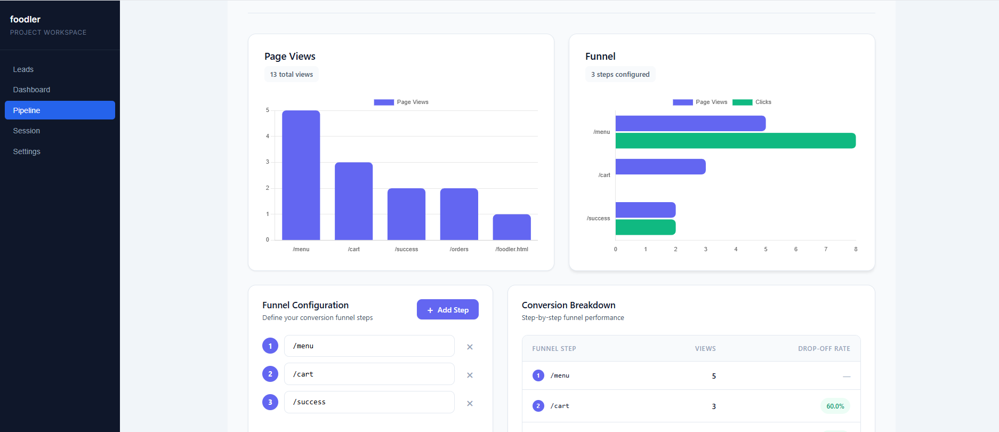
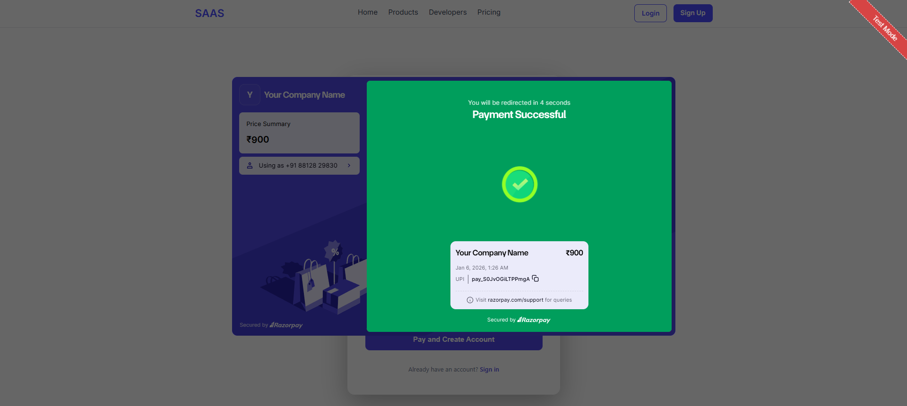

---

## Overview

**Insighty** is a **privacy-focused website analytics platform** that tracks **anonymous visitor sessions** and performs **identity stitching** to link sessions with converted leads. It provides **full customer journey visibility** and demonstrates a **SaaS demo** with secure authentication, payment integration, and a modern frontend.

---

## Demo

> Add a live demo link or GIF/screenshots here




---

## Key Features

- **Anonymous Visitor Tracking** – respects user privacy
- **Identity Stitching** – connects anonymous sessions to converted leads
- **Secure Authentication** – HTTP-only refresh tokens and runtime-only access tokens
- **Payment Integration** – Razorpay webhooks with idempotency for subscriptions and one-time payments
- **Intuitive Frontend** – Built with Svelte 5; dashboards for leads and analytics
- **Backend & Database** – FastAPI + PostgreSQL; modular structure for auth, database, models, and schemas

---

## Tech Stack

| Layer       | Technology                                         |
|------------|---------------------------------------------------|
| Frontend    | Svelte 5                                          |
| Backend     | FastAPI, Python                                   |
| Database    | PostgreSQL                                       |
| Payments    | Razorpay (webhooks, idempotency)                |
| Authentication | JWT with HTTP-only refresh tokens and runtime access tokens |

---

## Architecture

```
Frontend (Svelte 5)
       │
       ▼
REST API (FastAPI) ──> PostgreSQL
       │
       ▼
Razorpay Webhooks
```

- Visitors hit the website → tracked anonymously  
- Session events stored in PostgreSQL → linked to leads upon conversion  
- Dashboard visualizes analytics and lead journeys  
- Payments handled securely via Razorpay webhooks with idempotency  

---

## Installation

### Prerequisites

- Python 3.11+
- Node.js 20+
- PostgreSQL

### Backend Setup

```bash
cd backend

pip install -r sqlachemy fastapi
# Initialize Database
python init_db.py

# Run FastAPI
uvicorn main:app --reload
```

### Frontend Setup

```bash
cd my-svelte-app
npm install
npm run dev
```

---

## Usage

1. Visit the frontend (`localhost:5173`)  
2. Register a user or login  
3. Embed tracking snippet on your test website  
4. View dashboard analytics, leads, and conversion data  
5. Test payments via Razorpay sandbox

---

## Contributing

1. Fork the repository  
2. Create a branch: `git checkout -b feature/my-feature`  
3. Commit your changes: `git commit -m "Add new feature"`  
4. Push to branch: `git push origin feature/my-feature`  
5. Open a Pull Request

---

## License

MIT License © [Your Name]

---

## Resume/Portfolio Blurb

> Developed **Insighty**, a full-stack SaaS demo for privacy-focused analytics using **FastAPI**, **PostgreSQL**, and **Svelte 5**. Implemented **secure JWT-based authentication**, **Razorpay payment integration with webhooks**, and **identity stitching** to link anonymous sessions to leads, providing **end-to-end customer journey vi
